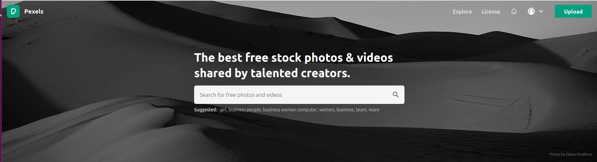
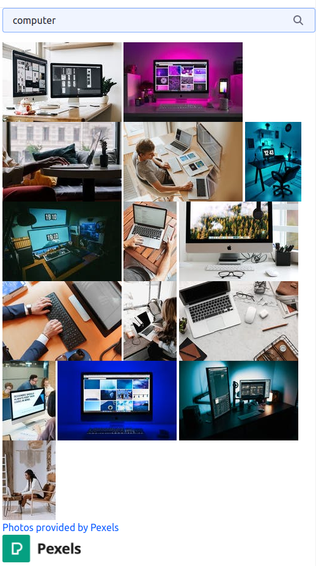
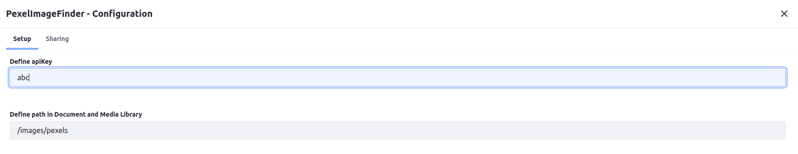

# Pexels Image Finder & Importer

With this portlet you can quickly search for images using pexels.com api.
If you click an image it will be downloaded/imported into the Document & Media Library.
Developed to run on the following versions of Liferay: `Liferay DXP 7.3`

Built with [Liferay Workspace](https://help.liferay.com/hc/en-us/articles/360029147471-Liferay-Workspace) and [Blade CLI](https://help.liferay.com/hc/en-us/articles/360029147071-Blade-CLI).






## How to Build and Deploy to Liferay

Follow the steps below to build and deploy or copy the modules from the [releases](../../releases/latest) page to your Liferay's deploy folder.

In order to build or deploy this module you will need to [install Blade CLI](https://help.liferay.com/hc/en-us/articles/360028833852-Installing-Blade-CLI).

### To Build

`$ blade gw build`

You can find the built modules at `modules/{module-name}/build/libs/{module-name}.jar`.

### To Deploy

In `gradle-local.properties` add the following line to point towards the Liferay instance you want to deploy to:
```
liferay.workspace.home.dir=/path/to/liferay/home
```

`$ blade gw deploy`

## Usage

* [Get API key](https://www.pexels.com/api/new/)
* Add widget PexelImageFinder to your page
* Configure widget to use your API key
* Enter path to store image in D&M Library, e.g. `/images/pexels`


### Features

* Search pexels.com for images
* Download/import images directly into the Document & Media Library

## Issues & Questions Welcome